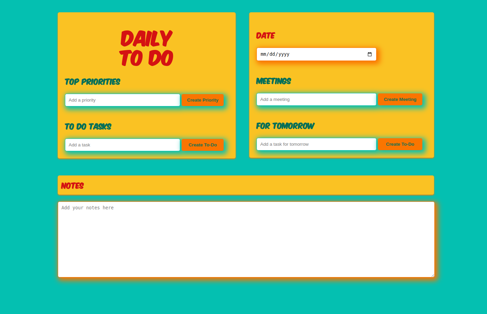

# To-Do-List App

Welcome to To-Do List, a simple yet powerful task management application.

## Description

To-Do List is a user-friendly web application that enables users to efficiently organize their tasks. With this app, users can:

1. **Add Items**: Easily add items to their to-do list through the input field provided.
2. **Mark as Complete**: Toggle the completion status of tasks with the "Complete/Tick" button.
3. **Delete Items**: Remove items from the list using the delete button associated with each task.

## Technologies Used

This project is built using the following technologies:

- HTML 🌐
- CSS 🎨
- Tailwind CSS 💅
- JavaScript 🛠️

## Usage

1. Open the application in your web browser.
2. Enter a task in the input field and press Enter or click the "Add" button to add it to the list.
3. To mark a task as complete, click the "Complete/Tick" button next to the task.
4. To delete a task, click on the delete button next to the task.

## Screenshots

[Include screenshots of your To-Do List app here]

## License

This project is licensed under the MIT License.

---
